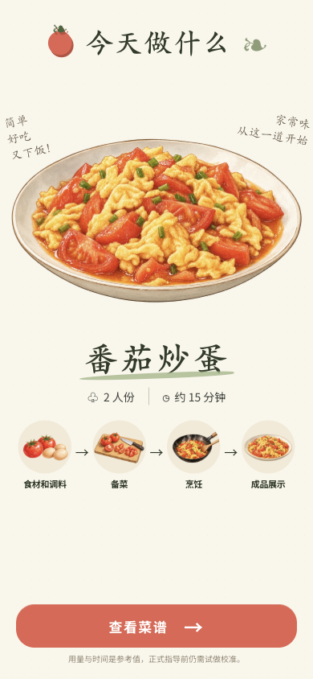
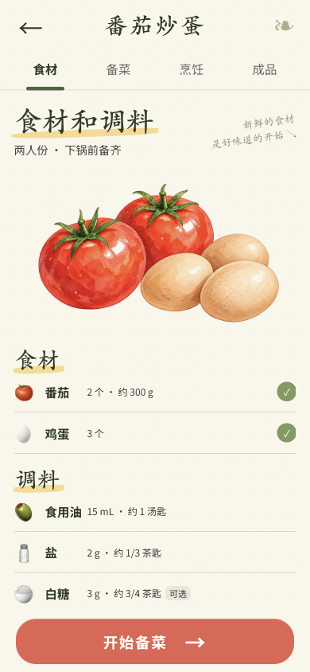
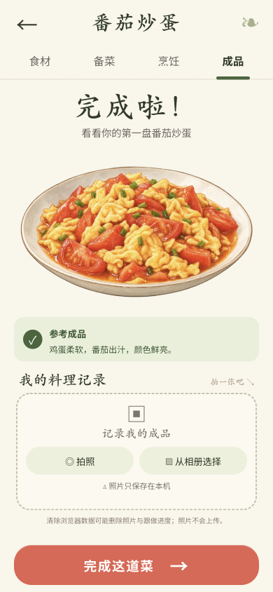

# 小厨手账 · Cute Cook Book

**先看清全程，再安心下锅。**

一个面向手机竖屏的手绘菜谱网页。从食材准备到装盘，把每一步的动作、用量、火候和完成标志放在一起，减少跟着视频做菜时反复暂停、拖动进度条的麻烦。

首道菜是 **番茄炒蛋**：2 人份、8 个步骤。当前版本使用静态水彩插画，完整演示通过手动切换分镜查看。

## 界面预览

以下图片来自实际运行界面。

<table>
  <tr>
    <td align="center"><strong>菜谱首页</strong><br></td>
    <td align="center"><strong>食材和调料</strong><br></td>
    <td align="center"><strong>备菜</strong><br></td>
  </tr>
  <tr>
    <td align="center"><strong>完整演示</strong><br></td>
    <td align="center"><strong>烹饪跟做</strong><br></td>
    <td align="center"><strong>成品与记录</strong><br></td>
  </tr>
</table>

## 怎样使用

1. **先看全局**：在首页了解菜谱，进入烹饪的「完整演示」，手动查看从备菜到装盘的全部分镜。
2. **备齐再开火**：核对食材和调料总量，洗切番茄、打散鸡蛋。
3. **跟着步骤做**：每步都有静态动作图、本次加入的数量、火候、参考时长和完成标志。完成后点击下一步。
4. **留下成品**：装盘后拍照或从相册选择照片，保存在本机的「我的料理记录」中。

## 功能特点

| 功能 | 当前行为 |
| --- | --- |
| 四阶段导航 | 食材和调料 → 备菜 → 烹饪 → 成品展示，可快速切换。 |
| 点击步骤节点 | 查看任意步骤；查看本身不标记完成，也不会启动该步计时。可以返回原步骤，或明确选择「从这步继续」。 |
| 量化用量 | 食材总量与每次下锅用量分别展示；调料同时显示克数／毫升和量勺约值。 |
| 火候与完成标志 | 使用小火、中火、大火的表达，并以食材状态帮助判断是否完成。 |
| 手动／自动计时 | 可手动开始倒计时；开启自动计时后，进入需要计时的步骤时自动开始。时间到后提示检查食材，不自动跳步。 |
| 本机进度 | 跟做进度和计时设置保存在浏览器，刷新后可恢复。 |
| 本机照片 | 支持拍照、选择、更换和删除照片；当前保存一张成品照片，不上传服务器。 |
| 手机一屏布局 | 固定页面外壳与底部操作按钮；长清单、步骤详情和料理记录可在各自区域内上下滑动。 |

切换到其他应用或锁屏后，倒计时仍按真实时间计算；回到网页时更新剩余时间，**不发送后台通知**。

## 本地运行

需要 npm，以及 **Node.js 20.x（≥20.19.0）或 Node.js ≥22.12.0**，符合 Vite 7 的运行要求。

```bash
git clone https://github.com/ShenZiLi/cute-cook-book.git
cd cute-cook-book
git switch dev
npm ci
npm run dev
```

打开终端显示的本地地址，默认是 `http://localhost:5173/`。使用同一局域网的手机访问终端显示的 Network 地址，即可体验手机界面。

```bash
# 代码与类型检查
npm run lint
npm run typecheck

# 状态逻辑和用量校验测试
npm run test

# 生成生产构建
npm run build

# 预览生产构建
npx vite preview --host 0.0.0.0
```

构建产物位于 `dist/`。部署到静态托管服务时，需要将 `/recipe` 等前端路由回退到 `index.html`。

## 技术与目录

| 技术 | 用途 |
| --- | --- |
| React 19 + TypeScript | 页面组件、步骤状态与类型约束 |
| Vite 7 | 本地开发与生产构建 |
| React Router 7 | 首页与菜谱页导航 |
| CSS + WebP 插画 | 纸张质感、手机布局和静态水彩场景 |
| localStorage + IndexedDB | 本机跟做进度与照片存储 |
| Vitest + ESLint | 状态逻辑测试与代码检查 |

```text
src/
├── App.tsx             # 首页、四阶段页面和手动分镜
├── Scene.tsx           # 静态插画场景
├── recipe.ts           # 食材、用量、步骤、火候和完成标志
├── progress.ts         # 跟做状态与真实时间倒计时
├── progress.test.ts    # 进度、计时与用量测试
├── photo.ts            # IndexedDB 照片存储
├── styles.css          # 手机竖屏样式
└── assets/             # 本地手绘素材
docs/
├── screenshots/        # README 实际界面截图
└── superpowers/        # 设计说明与原型图
.trellis/               # 项目规范、开发任务与日志
```

## 当前范围

当前提供一道番茄炒蛋菜谱和静态手绘分镜，尚未接入账号、云端同步或动画播放。用量与时间是参考样例，正式作为烹饪指导前仍需试做校准。

进度和照片只保存在当前浏览器；清除浏览器数据、切换设备或使用不同站点地址时，不会自动同步记录。
